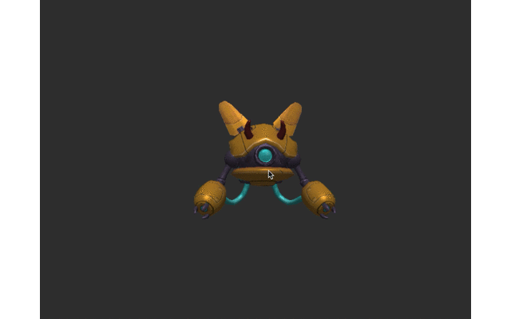

# Software Renderer

## Introduction
This is a simple implementation for software renderer without any graphics library (although I use SDL2 to create window and STB to load texture images). 


## Features:
- Depth testing
- Back face culling
- Perspective correct interpolation
- Bilinear texture filtering
- Blinn-Phong reflection model

## How to build
#### Windows :
Install MinGW and cmake.

```
cd SoftwareRenderer
mkdir build
cd build
cmake -G "MinGW Makefiles" ../
mingw32-make

cd ../publish
Renderer.exe
```

#### MacOS :
Install cmake.

```
cd SoftwareRenderer
mkdir build
cd build
cmake ..
make

cd ../publish
./Renderer
```

## Control
- Left mouse button drag : Orbit camera
- Right mouse buttion drag : Pan camera
- Mouse wheel : Zoom in/out
- <kbd>1</kbd> <kbd>2</kbd> : Change shaders 
- <kbd>w</kbd> <kbd>a</kbd> <kbd>s</kbd> <kbd>d</kbd>
: Move light when shader is type <kbd>2</kbd>
- <kbd>Lshift</kbd> : Back-face culling ON/OFF
- <kbd>c</kbd> : Reset camera and light
- <kbd>space</kbd> :  Wireframe mode ON/OFF

